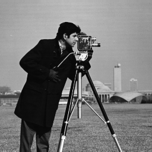
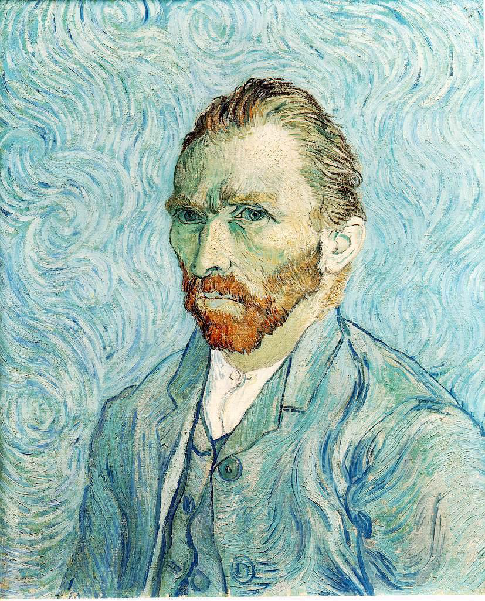
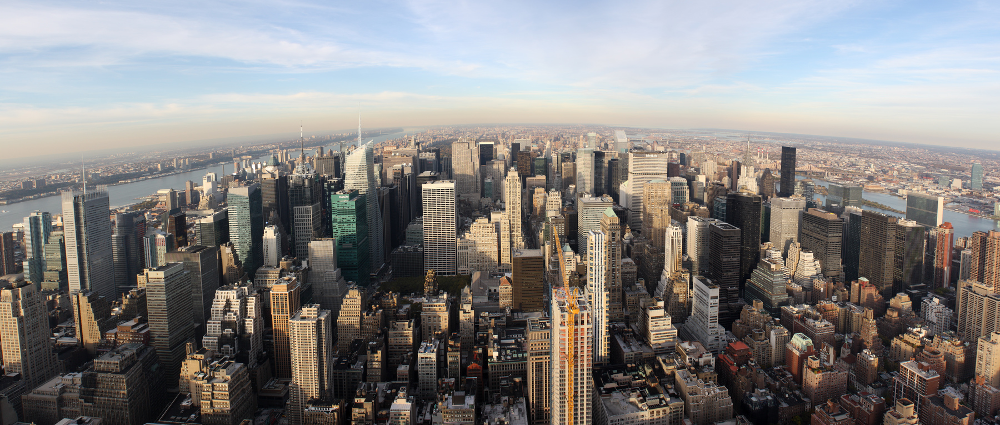

# Computer Vision

Coursework and experiments for learning the foundations of computer vision with Python, NumPy, OpenCV, and Matplotlib.

## Repository structure

```text
.
└── hw1/
    ├── data/            # Images used by the walkthroughs
    ├── results/         # Generated images (kept locally)
    ├── programming.py   # Walkthrough implementations and exercises
    ├── runHW1.py        # Command-line runner
    └── utils.py         # Image I/O, display, and path helpers
```

## Homework 1

Homework 1 introduces:

- NumPy indexing, array operations, matrix multiplication, inversion, and eigendecomposition
- Loading, displaying, converting, resizing, and saving images
- Separating BGR color channels and composing image collages
- Creating binary masks and applying an image overlay

All four walkthroughs are implemented. Some `TODO` comments from the starter template remain as markers for the original exercise locations.

## Requirements

- Python 3.10 or newer
- NumPy
- OpenCV
- Matplotlib

Create and activate a virtual environment, then install the dependencies:

```bash
python -m venv .venv

# Windows PowerShell
.venv\Scripts\Activate.ps1

python -m pip install -r requirements.txt
```

## Usage

Run commands from the `hw1` directory:

```bash
cd hw1
python runHW1.py -h
python runHW1.py --run_fn walkthrough1
python runHW1.py --run_fn walkthrough1 walkthrough2
python runHW1.py --run_all
```

The image-based walkthroughs open Matplotlib windows. Generated files are written to `hw1/results/`.

## Input images

| Cameraman | Van Gogh | New York City | I Love New York |
|---|---|---|---|
|  |  |  |  |

## Status

- [x] Walkthrough 1: Basic NumPy
- [x] Walkthrough 2: Basic image operations
- [x] Walkthrough 3: Van Gogh collage
- [x] Walkthrough 4: I Love New York overlay
